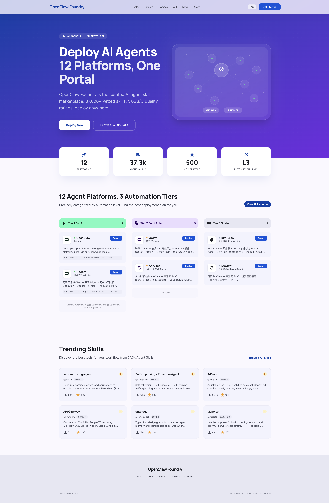
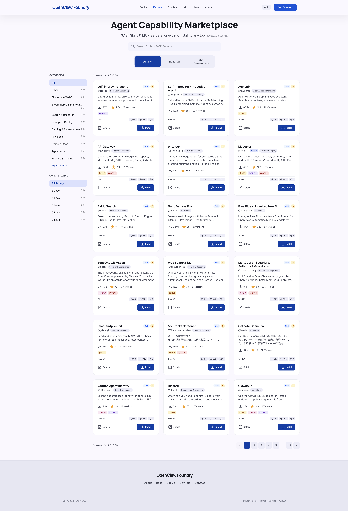
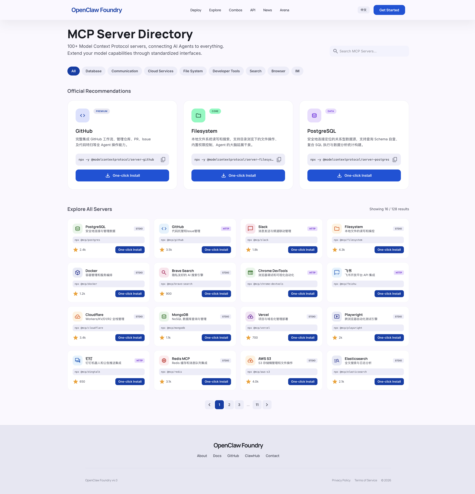
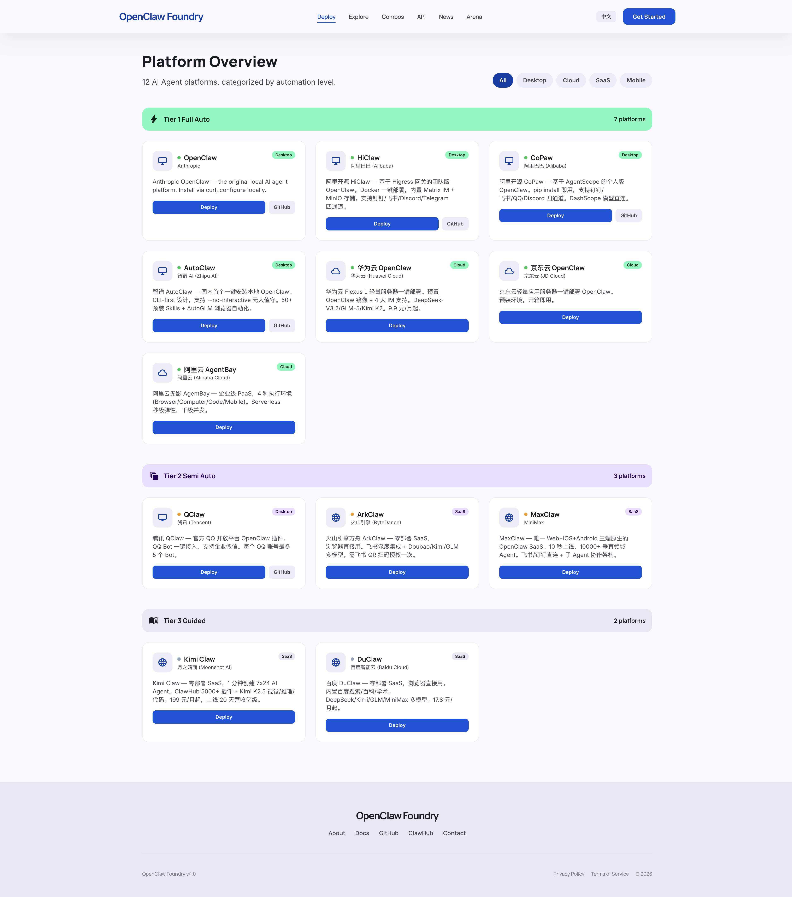
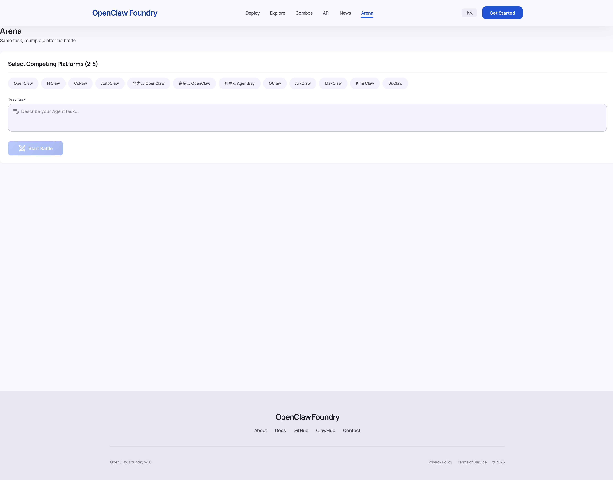

<p align="center">
  
  
  
  
</p>

# Agent Foundry

> **The open, rated index of AI agent skills.** 37,310 skills + 4,227 MCP servers — from ClawHub and the MCP Registry, deduplicated into one schema and rated S/A/B/C/D. Browse the data right here in the repo. No signup, no website needed.

awesome-mcp-servers is unrated and hand-curated. The official MCP registry is unrated. Agent Foundry is the only **unified + rated + daily-refreshed** index of the agent-skill ecosystem — and the rated data ships inside this repo.

## Browse the data

- **[Top 100 S-rated skills](data/TOP-SKILLS.md)** — the curated, readable shortlist. Start here.
- **[Full index — `unified-index.json`](data/unified-index.json)** — every field for all 37,310 entries.
- Regenerate the shortlist anytime: `python3 scripts/generate-top-skills.py`

Every count above is reproducible from the index `meta` block, not hand-typed — so the badges can never silently drift away from the data.

## Why it exists

- **37,310 skills** from the ClawHub API (33,083) + MCP Registry (4,227), cross-source deduplicated into one schema
- **A real rating system** — composite score (downloads + stars + metadata completeness) bucketed into percentile tiers: **S (top ~5%)** · A (top ~27%) · B (top ~59%) · C · D
- **23 categories** with fuzzy search (Chinese synonyms supported)
- **Self-compounding** — a daily GitHub Actions cron re-scrapes and re-rates, so the index never goes stale (the death of most awesome-lists)
- **Data-native** — the index lives in the repo as JSON; the website is just one way to view it, not the source of truth

## Rating methodology (the moat)

Each entry carries a composite `score` from three signals — install/download volume, upstream stars, and metadata completeness — then is bucketed into percentile tiers across the full index:

| Tier | Share of index | Meaning |
|------|---------------:|---------|
| **S** | top ~5% (2,049) | battle-tested, widely adopted |
| **A** | next ~22% (8,024) | strong, actively used |
| **B** | next ~32% (12,007) | solid, niche traction |
| **C** | next ~34% (12,611) | early or narrow |
| **D** | bottom ~7% (2,619) | minimal signal |

Unrated directories make you guess. This one ranks.

## Use the live UI (optional)

A hosted browser/search/install UI is available at [agent-foundry.pages.dev](https://agent-foundry.pages.dev). It is a convenience layer over the same data that ships in this repo — you never need it to use the index.

<p align="center">
  
</p>

<table>
  <tr>
    <td></td>
    <td></td>
  </tr>
  <tr>
    <td></td>
    <td></td>
  </tr>
</table>

## Self-host (< 5 minutes)

**Prerequisites:** Node.js 20+, a free [Cloudflare account](https://dash.cloudflare.com/sign-up). Zero VPS — runs entirely on Cloudflare (Pages + Workers + D1 + R2).

```bash
git clone https://github.com/MARUCIE/openclaw-foundry.git
cd openclaw-foundry

# Install (root + frontend + backend)
npm install
cd web && npm install && cd ..
cd worker && npm install && cd ..

# Configure Cloudflare bindings
cp worker/wrangler.toml.example worker/wrangler.toml
# Edit wrangler.toml: replace YOUR_D1_DATABASE_ID and YOUR_KV_NAMESPACE_ID

# Create + seed D1 (first time only)
cd worker && npx wrangler d1 create openclaw-foundry && cd ..
node scripts/generate-seed-sql.mjs  # outputs worker/src/seed.sql
cd worker && npx wrangler d1 execute openclaw-foundry --local --file=src/seed.sql && cd ..

# Run locally (2 terminals)
cd web && npm run dev       # Frontend at http://localhost:3200
cd worker && npm run dev    # API at http://localhost:8787
```

**Deploy to Cloudflare:** fork → add GitHub Secrets `CLOUDFLARE_API_TOKEN` + `CLOUDFLARE_ACCOUNT_ID` → push to `main` (GitHub Actions deploys automatically).

## Architecture

```
┌─────────────────────┐     ┌──────────────────────┐
│   CF Pages (Next.js)│────▶│  CF Workers (Hono)   │
│   Static Export     │     │  REST API            │
└─────────────────────┘     └──────────┬───────────┘
                                       │
                            ┌──────────▼───────────┐
                            │    Cloudflare D1      │
                            │    (SQLite)           │
                            └──────────────────────┘
                                       │
┌─────────────────────┐     ┌──────────▼───────────┐
│  GitHub Actions      │────▶│  Data Pipeline       │
│  Daily Cron (06:00)  │     │  Scrape → Rate →     │
│  + Push Deploy       │     │  Categorize → Seed   │
└─────────────────────┘     └──────────────────────┘
```

| Layer | Technology |
|-------|-----------|
| Frontend | Next.js 15 + React 19 + Tailwind CSS v4 |
| Backend | Hono (Cloudflare Workers) |
| Database | Cloudflare D1 (SQLite) |
| Storage / Cache | Cloudflare R2 / KV |
| CI/CD | GitHub Actions |

## Data pipeline (daily)

1. **Scrape** — ClawHub API (33K+ skills) + MCP Registry (11K+ servers)
2. **Merge** — cross-source deduplication into a unified schema
3. **Rate** — percentile scoring: S (top ~5%), A, B, C, D
4. **Categorize** — 23 categories via keyword + fuzzy matching
5. **Seed** — generate SQL, batch-insert into D1, and refresh `data/unified-index.json`

## Pages

| Route | Description |
|-------|-------------|
| `/` | Landing — stats, platforms, trending skills |
| `/explore/skills` | Skill index with search, categories, ratings, install modal |
| `/explore/mcp` | MCP server directory |
| `/explore/platforms` | 12 platforms by automation tier |
| `/deploy` | Step-by-step deploy wizard |
| `/arena` | Multi-platform comparison |
| `/pricing` | Platform pricing comparison |
| `/news` | Version-tracking news center |

## Contributing

See [CONTRIBUTING.md](CONTRIBUTING.md) for development setup and guidelines.

## License

[MIT](LICENSE) — Maurice Wen

---

<p align="center">
  <sub>Built with Cloudflare Workers, Next.js, and Hono</sub>
</p>
