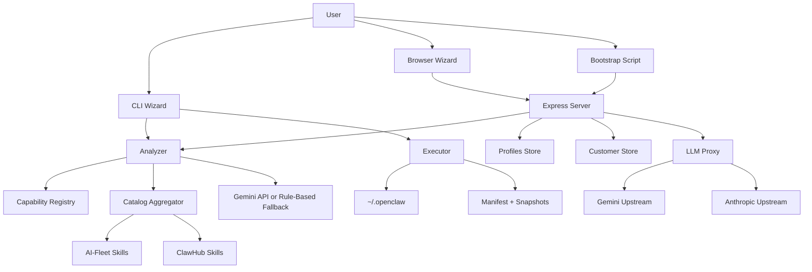
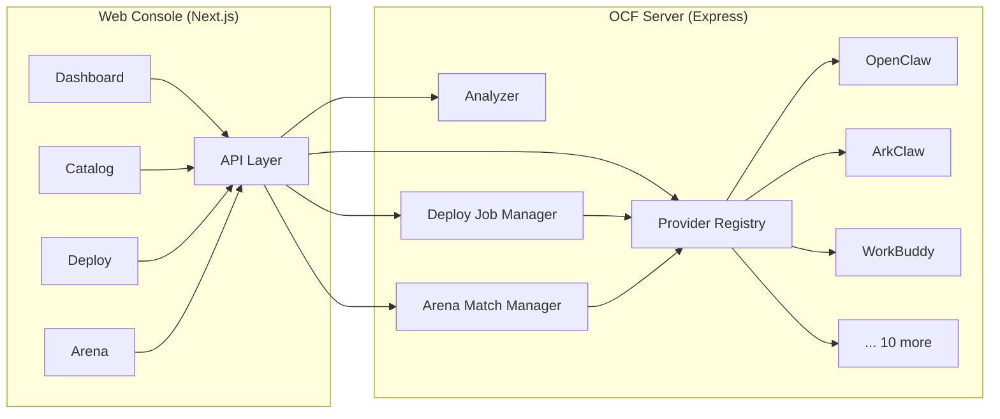

# SYSTEM_ARCHITECTURE - OpenClaw Foundry

## AI-Managed Project Block
- PROJECT_DIR: `/Users/mauricewen/Projects/22-openclaw-foundry`
- Canonical Initiative Path: `doc/00_project/initiative_openclaw_foundry/`
- Updated: `2026-03-22`

## System Boundary
OpenClaw Foundry v4.0 升维为**一键部署 + 导航 + 资讯站 + 商业化平台**，支持 **12 platforms** across 3 Tiers (全自动/半自动/引导式)。从内部 Console 升级为公开 Portal。

Runtime styles:
1. local execution through the `ocf` CLI
2. remote execution through an Express server plus static browser/bootstrap clients
3. multi-platform deployment via Provider dispatch

The shared contract is `Blueprint v2.0`, a typed JSON document now including a `target` field for platform routing.

## High-Level Modules
| Module | Files | Responsibility |
| --- | --- | --- |
| CLI shell | `src/cli.ts`, `src/wizard.ts` | Collect local input, platform selection, call AI/catalog flows, execute lifecycle commands |
| Analysis engine | `src/analyzer.ts`, `src/capability-registry.ts` | Convert wizard answers and catalog data into `Blueprint`, then normalize and repartition |
| Catalog layer | `src/catalog.ts` | Scan local AI-Fleet skills and remote ClawHub skills |
| **Provider system** | `src/providers/*.ts` (12 files) | **v2.0: Multi-platform deployment abstraction (deploy/test/repair/uninstall/diagnose)** |
| Execution layer | `src/executor.ts` | Legacy install/export/repair/upgrade/rollback (wrapped by OpenClawProvider) |
| Server/API | `src/server.ts` | Expose health, analyze, catalog, providers, profile, customer, and LLM proxy |
| Persistence | `src/profiles.ts`, `src/customers.ts` | Store reusable profiles and managed customer tokens/usage |
| LLM gateway | `src/llm-proxy.ts` | Customer-authenticated OpenAI-compatible chat proxy |
| Static client | `client/` | Browser wizard with platform selection, bootstrap scripts |
| **Web Console** | `web/` (Next.js 15) | **v3.0: Visual management — Platform Catalog, One-Click Deploy, Arena** |
| **Deploy Manager** | `src/deploy-manager.ts` | **v3.0: Async deploy job lifecycle (create/poll/cancel)** |
| **Arena Engine** | `src/arena-engine.ts` | **v3.0: Multi-provider parallel execution + scoring** |

## Provider Architecture (v2.0)
```
Blueprint.target.provider → ProviderRegistry.getProvider() → Provider.deploy()

BaseProvider (abstract)
├── CloudProvider (checkApiAccess, checkApiHealth, getEndpoint)
│   ├── JDCloudProvider (genericCloudDeploy)
│   │   ├── HuaweiCloudProvider
│   │   ├── AliyunProvider
│   │   └── DuClawProvider
│   ├── ArkClawProvider
│   └── WorkBuddyProvider
├── DesktopProvider (checkLocalInstall)
│   ├── OpenClawProvider (wraps legacy executor)
│   ├── LobsterAIProvider
│   └── AutoClawProvider
├── SaaSProvider (checkApiHealth)
│   ├── KimiClawProvider
│   └── MaxClawProvider
├── MobileProvider (checkDeviceConnection)
│   └── MiClawProvider
└── BaseProvider (direct)
    └── LenovoProvider (remote service)
```

### Supported Platforms (13)
| ID | Name | Vendor | Type | Status |
|----|------|--------|------|--------|
| openclaw | OpenClaw | Anthropic | desktop | stable |
| workbuddy | WorkBuddy/QClaw | Tencent | desktop | stable |
| lobsterai | LobsterAI | NetEase Youdao | desktop | beta |
| autoclaw | AutoClaw | Zhipu AI | desktop | stable |
| arkclaw | ArkClaw | ByteDance | saas | stable |
| duclaw | DuClaw | Baidu Cloud | saas | stable |
| kimiclaw | Kimi Claw | Moonshot AI | saas | stable |
| maxclaw | MaxClaw | MiniMax | saas | stable |
| jdcloud | JD Cloud OpenClaw | JD Cloud | cloud | beta |
| huaweicloud | Huawei Cloud | Huawei Cloud | cloud | beta |
| aliyun | AgentBay | Alibaba Cloud | cloud | stable |
| miclaw | miclaw | Xiaomi | mobile | preview |
| lenovo | Lenovo BaiYing | Lenovo | remote | preview |

## Runtime Topology


## Core Data Objects
1. `WizardAnswers` / `WizardAnswersV2`
   - Structured user intent collected from CLI or browser
   - v2 adds: `targetProvider`, `targetDeployMode`, `targetRegion`, `targetImChannel`, cloud credentials
2. `Blueprint` (v2.0)
   - Canonical deployment contract
   - Includes meta, **target** (provider + deployMode + credentials), identity, skills, agents, config, cron, MCP servers, extensions, LLM
   - `target` defaults to `{provider:'openclaw', deployMode:'local'}` for backward compatibility
3. `Provider` (interface)
   - Multi-platform deployment abstraction
   - Methods: deploy, test, repair, uninstall, diagnose, getRequirements, isAvailable
4. `Manifest`
   - Records files and directories written by Foundry
5. `Snapshot`
   - Captures pre-change installation state for rollback
6. `Customer`
   - Managed LLM subscriber record with token, tier, and usage stats

## Contract Guardrails
1. AI-generated blueprints are normalized before return
2. System-owned fields are enforced from trusted inputs:
   - `meta.os`
   - `meta.created`
   - `identity.role`
   - `config.autonomy`
   - `llm`
3. Skill IDs are deduplicated and re-partitioned against the current catalog source map

## Entrypoints
### CLI
- `npm run ocf -- init`
- `npm run ocf -- cast <file>`
- `npm run ocf -- doctor`

### Server
- `npm run server`
- `npm run dev`

### HTTP
- `GET /api/health` — includes provider stats
- `POST /api/analyze`
- `GET /api/catalog`
- **`GET /api/providers`** — list all 13 platforms (filter: ?type=, ?os=)
- **`GET /api/providers/:id`** — platform detail + requirements + availability
- **`GET /api/providers/:id/diagnose`** — platform health check
- `GET /api/profiles`
- `GET /api/profiles/:id`
- `POST /api/customers`
- `GET /api/customers`
- `GET /api/customers/:id`
- `PATCH /api/customers/:id/tier`
- `DELETE /api/customers/:id`
- `GET /llm/v1/models`
- `POST /llm/v1/chat/completions`
- `GET /foundry.sh`
- `GET /foundry.ps1`
- static files from `client/`

## Deployment / Storage Model
1. Repo-local:
   - `profiles/*.json`
   - `data/customers.json`
2. User machine:
   - `~/.openclaw/openclaw.json`
   - `~/.openclaw/IDENTITY.md`
   - `~/.openclaw/SOUL.md`
   - `~/.openclaw/skills/`
   - `~/.openclaw/agents/`
   - `~/.openclaw/.foundry-manifest.json`
   - `~/.openclaw/.snapshots/`

---

## Web Console Architecture (v3.0)

### Overview
Web Console 是 OpenClaw Foundry 的可视化管理界面，提供三大核心能力：

| Module | Purpose | Core Interaction |
|--------|---------|-----------------|
| **Platform Catalog** | 浏览全部 13 个 **Claw 平台，按类型/状态/OS 筛选 | 卡片网格 + 详情面板 |
| **One-Click Deploy** | 选择平台 → 配置 Blueprint → 一键部署 | 步骤向导 (Stepper) |
| **Arena 比武场** | 同一任务 dispatch 到多个 Claw，并行执行并横向对比 | 多列对比面板 + 实时状态 |

### Frontend Architecture

```
web/                          # Next.js 15 App Router
├── app/
│   ├── layout.tsx            # Root layout (sidebar + header)
│   ├── page.tsx              # Dashboard (overview stats)
│   ├── catalog/
│   │   ├── page.tsx          # Platform catalog grid
│   │   └── [id]/page.tsx     # Platform detail + requirements
│   ├── deploy/
│   │   ├── page.tsx          # Deploy wizard (stepper)
│   │   └── [jobId]/page.tsx  # Deploy job status
│   └── arena/
│       ├── page.tsx          # Arena setup (select task + claws)
│       └── [matchId]/page.tsx # Arena live match view
├── components/
│   ├── ui/                   # shadcn/ui primitives
│   ├── platform-card.tsx     # Provider card with status badge
│   ├── deploy-stepper.tsx    # Multi-step deploy flow
│   ├── arena-lane.tsx        # Single claw lane in arena
│   ├── blueprint-editor.tsx  # Blueprint JSON editor
│   └── status-badge.tsx      # Provider status indicator
├── lib/
│   ├── api.ts                # OCF server API client
│   ├── types.ts              # Shared types (re-export from src/)
│   └── hooks/
│       ├── use-providers.ts  # SWR hook for provider list
│       ├── use-deploy.ts     # Deploy job polling
│       └── use-arena.ts      # Arena match state
└── tailwind.config.ts
```

Tech stack: **Next.js 15** + **Tailwind v4** + **shadcn/ui** + **SWR** for data fetching.
Connects to existing Express server at `localhost:18800`.

### New Server API Endpoints (v3.0)

| Method | Path | Purpose | Module |
|--------|------|---------|--------|
| POST | `/api/deploy` | Start a deploy job (async) | Deploy |
| GET | `/api/deploy/:jobId` | Poll deploy job status | Deploy |
| POST | `/api/deploy/:jobId/cancel` | Cancel running deploy | Deploy |
| POST | `/api/arena` | Create arena match (N providers, 1 blueprint) | Arena |
| GET | `/api/arena/:matchId` | Poll arena match status | Arena |
| GET | `/api/arena/:matchId/results` | Final comparison results | Arena |
| GET | `/api/stats` | Aggregate dashboard stats | Dashboard |

### Deploy Job Model

```typescript
interface DeployJob {
  id: string;                    // "deploy-{timestamp}"
  status: 'pending' | 'running' | 'success' | 'failed' | 'cancelled';
  provider: ProviderId;
  blueprint: Blueprint;
  createdAt: string;
  startedAt?: string;
  completedAt?: string;
  result?: DeployResult;
  logs: StepResult[];            // Streaming step log
}
```

Deploy flow: POST /api/deploy → 202 Accepted (jobId) → GET poll → final result.
Server stores jobs in-memory Map with TTL (1 hour).

### Arena Match Model

```typescript
interface ArenaMatch {
  id: string;                    // "arena-{timestamp}"
  status: 'setup' | 'running' | 'completed' | 'failed';
  task: {
    blueprint: Blueprint;        // Shared blueprint template
    testPrompt: string;          // The task all claws will execute
  };
  lanes: ArenaLane[];            // One per selected provider
  createdAt: string;
  completedAt?: string;
  winner?: ProviderId;           // Auto-determined or user-voted
  scoring?: ArenaScoring;
}

interface ArenaLane {
  provider: ProviderId;
  status: 'pending' | 'deploying' | 'testing' | 'done' | 'error';
  deployResult?: DeployResult;
  testResult?: TestResult;
  timing: {
    deployMs?: number;
    testMs?: number;
    totalMs?: number;
  };
  score?: number;                // 0-100 composite score
}

interface ArenaScoring {
  dimensions: {
    deploySpeed: Record<ProviderId, number>;    // Lower ms = higher score
    testPassRate: Record<ProviderId, number>;   // % checks passed
    featureSupport: Record<ProviderId, number>; // Requirements met
    platformReach: Record<ProviderId, number>;  // OS + IM coverage
  };
  overall: Record<ProviderId, number>;
  method: 'weighted-average';
  weights: { deploySpeed: 0.2; testPassRate: 0.4; featureSupport: 0.25; platformReach: 0.15 };
}
```

Arena flow:
1. User selects 2-5 providers + writes a task prompt
2. POST /api/arena → creates match, spawns parallel deploy+test per lane
3. Frontend polls GET /api/arena/:matchId → updates lane status in real-time
4. When all lanes complete → server computes scoring → determines winner
5. Frontend shows side-by-side comparison with scores + timing + logs

### Page Architecture

#### P1: Dashboard (`/`)
- Provider count by type (4 cards: Desktop / SaaS / Cloud / Mobile+Remote)
- Recent deploy jobs (last 5)
- Recent arena matches (last 3)
- System health (server uptime, API latency)

#### P2: Platform Catalog (`/catalog`)
- Filter bar: type | status | OS | IM channel
- Card grid: each card shows logo placeholder, name, vendor, type badge, status badge
- Click → detail page with:
  - Full provider meta
  - Requirements checklist (with live availability check)
  - Quick actions: Deploy / Add to Arena / Diagnose
  - Console URL + Doc URL external links

#### P3: Deploy Flow (`/deploy`)
- Step 1: Select provider (from catalog or dropdown)
- Step 2: Configure blueprint (profile preset or manual JSON editor)
- Step 3: Review blueprint summary
- Step 4: Deploy + real-time log streaming
- Step 5: Result summary + next actions (test / diagnose / open console)

#### P4: Arena (`/arena`)
- Setup panel: select 2-5 providers + enter task prompt
- Live view: N columns (one per provider), each showing:
  - Status indicator (spinner → checkmark/cross)
  - Deploy steps log
  - Test results
  - Timing
- Results panel: radar chart + score table + winner badge

### Data Flow



### Security Constraints
- Web Console runs same-origin or CORS with existing `x-api-key` guard
- Cloud credentials (accessKeyId/Secret) are server-side only, never sent to frontend
- Arena matches are rate-limited (max 3 concurrent, 10/hour)
- Deploy jobs respect existing `checkApiReady()` guard per provider

## Architecture Risks
1. Provider routing gap:
   - `routeModel()` can return `openai`, but `createLlmProxy()` does not implement an OpenAI upstream caller
2. Persistence simplicity:
   - customers are stored in a JSON file, which is acceptable for MVP but weak for concurrent writes
   - Deploy jobs and arena matches use in-memory Map (acceptable for single-instance, lost on restart)
3. Git boundary mismatch:
   - repository directory lives inside a parent git root, which weakens project-isolated git health checks
4. Export parity gap:
   - exported installers do not preserve full equivalence with local execution for AI-Fleet symlinked skills
5. Auth boundary split:
   - `/api/*` uses optional shared API key, while `/llm/v1/*` uses bearer customer tokens
6. Documentation split:
   - `docs/` historical material can drift unless future changes only update `doc/`
7. Arena concurrency:
   - Parallel provider.deploy() calls share the same process; a slow/hanging provider blocks the event loop
   - Mitigation: per-lane timeout (60s) + AbortController
8. Web Console coupling:
   - Next.js dev server + Express server run on different ports; production needs reverse proxy or embedding
   - Mitigation: Next.js `rewrites` proxy `/api/*` to OCF server in dev; production co-locate or Caddy proxy

---

## v4.0 升维: Console → Portal (一键部署 + 导航 + 资讯 + 商业化)

### 升维动机

v3.0 是内部管理 Console (4 页: Dashboard/Catalog/Deploy/Arena)。
v4.0 定位为**中国 OpenClaw 生态一站式公开入口**:
- 流量入口: SEO + 社区传播 → 用户发现 OpenClaw 平台
- 部署入口: 12 平台一键部署 (3 Tier 自动化)
- 导航入口: ClawHub Skill 市场 + MCP 服务器目录
- 资讯入口: 大厂动态 + 版本追踪 + 教程
- 商业入口: 云厂商返佣 + 企业部署服务

### v4.0 Provider 架构 (v3.0 审计后重建)

v2.0/v3.0 审计发现: 13 Provider 中仅 OpenClaw 1 个真实 (7.7%)，其余 12 个 API 全是编造的。
v4.0 基于 9 个研究 Agent 的调查结果重建:

```
Tier 1 全自动 (7)              Tier 2 半自动 (3)            Tier 3 引导式 (2)
├── openclaw (curl+files)      ├── qclaw (QQ Bot)           ├── kimiclaw (Web SaaS)
├── hiclaw (curl+Higress)      ├── arkclaw (飞书 QR)        └── duclaw (Web SaaS)
├── copaw (pip+CLI)            └── maxclaw (注册+API)
├── autoclaw (CLI --no-interactive)
├── huaweicloud (Python SDK)
├── jdcloud (Python SDK)
└── aliyun (Python SDK)
```

砍掉: miclaw(封测) / 联想(IT服务) / WorkBuddy(合并QClaw) / LobsterAI(需源码构建)
新增: hiclaw(阿里开源团队版) / copaw(阿里开源个人版) / qclaw(腾讯QQ Bot)

### v4.0 页面架构 (Information Architecture)

```
/                              首页 Landing
│                              Hero + 12 平台卡片 + 快速部署 CTA + 最新资讯
│
├── /deploy                    一键部署
│   ├── /deploy/[provider]     平台专属页 (12个, 各含部署向导)
│   └── /deploy/history        部署历史
│
├── /explore                   导航发现
│   ├── /explore/platforms     平台目录 (12平台, Tier/Type 筛选, 对比工具)
│   ├── /explore/skills        ClawHub Skill 市场 (搜索/分类/一键安装)
│   ├── /explore/mcp           MCP 服务器目录
│   └── /explore/compare       平台对比 (2-3 平台并排)
│
├── /news                      资讯中心
│   ├── /news/feed             信息流 (RSS 聚合)
│   ├── /news/releases         版本追踪 (各平台 changelog)
│   └── /news/tutorials        教程合集
│
├── /arena                     竞技场 (保留, 增强)
├── /pricing                   定价对比 + 返佣入口
└── /about                     关于 + 企业合作
```

### vs v3.0 变更矩阵

| v3.0 Page | v4.0 Page | 变化 |
|-----------|-----------|------|
| `/` Dashboard (内部统计) | `/` Hero Landing (公开) | 管理后台 → 公开入口 |
| `/catalog` (平台列表) | `/explore/platforms` (导航+对比) | +Tier 徽章 +价格 +对比 |
| `/deploy` (4步向导) | `/deploy/[provider]` (专属页) | 每平台独立 |
| `/arena` (竞技场) | `/arena` (保留增强) | +评分维度 |
| — | `/explore/skills` | 新增 ClawHub |
| — | `/explore/mcp` | 新增 MCP 目录 |
| — | `/news` | 新增资讯聚合 |
| — | `/pricing` | 新增商业化 |

### 新增数据模型

```typescript
// ClawHub Skill 条目
interface SkillEntry {
  id: string;
  name: string;
  description: string;
  source: 'clawhub' | 'tencent-fork' | 'aifleet' | 'community';
  category: string;
  installCmd: string;
  stars?: number;
  downloads?: number;
  compatibleProviders: ProviderId[];
  tags: string[];
}

// MCP 服务器条目
interface McpServerEntry {
  id: string;
  name: string;
  description: string;
  type: 'stdio' | 'http' | 'sse';
  installCmd: string;
  npmPackage?: string;
  github?: string;
  category: string;
}

// 资讯条目
interface NewsItem {
  id: string;
  title: string;
  summary: string;
  url: string;
  source: string;
  category: 'release' | 'tutorial' | 'news' | 'analysis';
  publishedAt: string;
  tags: string[];
  provider?: ProviderId;
}

// 平台定价
interface PricingTier {
  providerId: ProviderId;
  tiers: {
    name: string;
    price: string;
    features: string[];
    affiliateUrl?: string;
  }[];
}
```

### 商业化模型

| 收入来源 | 模式 | 入口 |
|----------|------|------|
| 云厂商 CPS 返佣 | 华为/京东/阿里注册链接 | /pricing + /deploy |
| 企业部署服务 | 定制部署+培训 | /about 表单 |
| Skill 市场分成 | 付费 Skill 上架 | /explore/skills |
| 流量广告 | 导航站 Banner | 全站 |
| 数据报告 | 行业分析 | 付费订阅 |

### 技术栈 (增量)

| 新增 | 技术 | 用途 |
|------|------|------|
| ISR | Next.js Incremental Static Regeneration | 资讯页 6h 刷新 |
| RSS Parser | `rss-parser` npm | 聚合 IT之家/36kr |
| GitHub API | Octokit | 版本追踪 |
| SQLite/Turso | 持久化 | 部署历史+资讯缓存 |
| Plausible | 分析 | 隐私友好 |
| Vercel/CF Pages | 部署 | 静态+SSR |

### Stitch 设计管线

架构确认后，走 3 轮 Stitch 设计:

| Round | 页面 | 产出 |
|-------|------|------|
| R1 | 首页 Hero + 快速部署 | 3 方案 → 选 Winner |
| R2 | Skill 市场 + MCP 目录 | 3 方案 → 选 Winner |
| R3 | 资讯中心 + 定价页 | 3 方案 → 选 Winner |

### 实施路线

| Phase | 内容 | 依赖 |
|-------|------|------|
| P0 | Provider v3.0 真实实现 (进行中) | — |
| P1 | Stitch R1: 首页 + 部署页 | P0 |
| P2 | Stitch R2: Skill + MCP 导航 | P1 |
| P3 | 资讯聚合引擎 + /news | P1 |
| P4 | 商业化: /pricing + 返佣 | P2 |
| P5 | Stitch R3: 资讯 + 定价 | P3+P4 |
