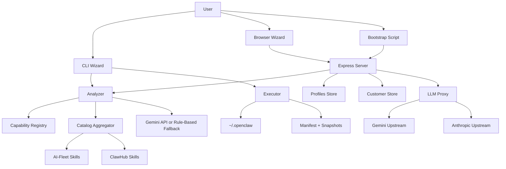

# SYSTEM_ARCHITECTURE - OpenClaw Foundry

## AI-Managed Project Block
- PROJECT_DIR: `/Users/mauricewen/Projects/22-openclaw-foundry`
- Canonical Initiative Path: `doc/00_project/initiative_openclaw_foundry/`
- Updated: `2026-03-11`

## System Boundary
OpenClaw Foundry is a single Node.js codebase that supports two runtime styles:
1. local execution through the `ocf` CLI
2. remote execution through an Express server plus static browser/bootstrap clients

The shared contract between both styles is `Blueprint`, a typed JSON document describing an OpenClaw setup.

## High-Level Modules
| Module | Files | Responsibility |
| --- | --- | --- |
| CLI shell | `src/cli.ts`, `src/wizard.ts` | Collect local input, call AI/catalog flows, execute lifecycle commands |
| Analysis engine | `src/analyzer.ts`, `src/capability-registry.ts` | Convert wizard answers and catalog data into `Blueprint`, then normalize system-owned fields and repartition skills by catalog |
| Catalog layer | `src/catalog.ts` | Scan local AI-Fleet skills and remote ClawHub skills |
| Execution layer | `src/executor.ts` | Install, export, repair, upgrade, rollback, uninstall, snapshot |
| Server/API | `src/server.ts` | Expose health, analyze, catalog, profile, customer, static assets, and LLM proxy |
| Persistence | `src/profiles.ts`, `src/customers.ts` | Store reusable profiles and managed customer tokens/usage |
| LLM gateway | `src/llm-proxy.ts` | Customer-authenticated OpenAI-compatible chat proxy |
| Static client | `client/` | Browser wizard, thin bootstrap scripts, role pipeline manual |

## Runtime Topology

## Core Data Objects
1. `WizardAnswers`
   - Structured user intent collected from CLI or browser
2. `Blueprint`
   - Canonical deployment contract
   - Includes meta, identity, skills, agents, config, cron, MCP servers, extensions, and LLM settings
3. `Manifest`
   - Records files and directories written by Foundry
4. `Snapshot`
   - Captures pre-change installation state for rollback
5. `Customer`
   - Managed LLM subscriber record with token, tier, and usage stats

## Contract Guardrails
1. AI-generated blueprints are normalized before return
2. System-owned fields are enforced from trusted inputs:
   - `meta.os`
   - `meta.created`
   - `identity.role`
   - `config.autonomy`
   - `llm`
3. Skill IDs are deduplicated and re-partitioned against the current catalog source map

## Entrypoints
### CLI
- `npm run ocf -- init`
- `npm run ocf -- cast <file>`
- `npm run ocf -- doctor`

### Server
- `npm run server`
- `npm run dev`

### HTTP
- `GET /api/health`
- `POST /api/analyze`
- `GET /api/catalog`
- `GET /api/profiles`
- `GET /api/profiles/:id`
- `POST /api/customers`
- `GET /api/customers`
- `GET /api/customers/:id`
- `PATCH /api/customers/:id/tier`
- `DELETE /api/customers/:id`
- `GET /llm/v1/models`
- `POST /llm/v1/chat/completions`
- `GET /foundry.sh`
- `GET /foundry.ps1`
- static files from `client/`

## Deployment / Storage Model
1. Repo-local:
   - `profiles/*.json`
   - `data/customers.json`
2. User machine:
   - `~/.openclaw/openclaw.json`
   - `~/.openclaw/IDENTITY.md`
   - `~/.openclaw/SOUL.md`
   - `~/.openclaw/skills/`
   - `~/.openclaw/agents/`
   - `~/.openclaw/.foundry-manifest.json`
   - `~/.openclaw/.snapshots/`

## Architecture Risks
1. Provider routing gap:
   - `routeModel()` can return `openai`, but `createLlmProxy()` does not implement an OpenAI upstream caller
2. Persistence simplicity:
   - customers are stored in a JSON file, which is acceptable for MVP but weak for concurrent writes
3. Git boundary mismatch:
   - repository directory lives inside a parent git root, which weakens project-isolated git health checks
4. Export parity gap:
   - exported installers do not preserve full equivalence with local execution for AI-Fleet symlinked skills
5. Auth boundary split:
   - `/api/*` uses optional shared API key, while `/llm/v1/*` uses bearer customer tokens
6. Documentation split:
   - `docs/` historical material can drift unless future changes only update `doc/`
