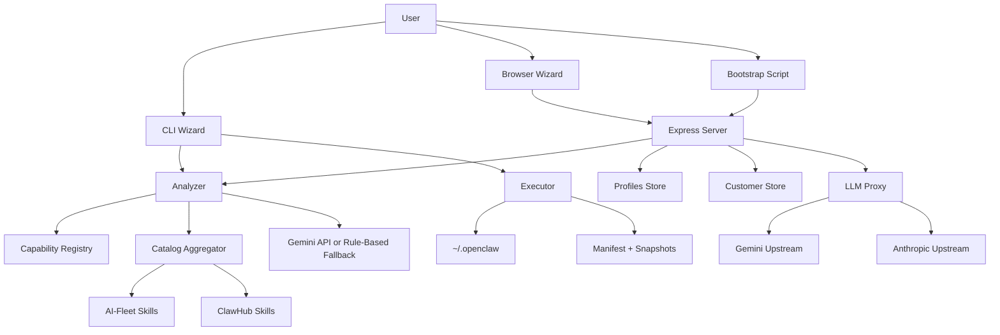

# SYSTEM_ARCHITECTURE - OpenClaw Foundry

## AI-Managed Project Block
- PROJECT_DIR: `/Users/mauricewen/Projects/22-openclaw-foundry`
- Canonical Initiative Path: `doc/00_project/initiative_openclaw_foundry/`
- Updated: `2026-03-20`

## System Boundary
OpenClaw Foundry v2.0 is a universal Agent deployment platform supporting **13 platforms** across 5 categories (Desktop/SaaS/Cloud/Mobile/Remote). The system uses a **Provider abstraction layer** to dispatch a single Blueprint to any supported platform.

Runtime styles:
1. local execution through the `ocf` CLI
2. remote execution through an Express server plus static browser/bootstrap clients
3. multi-platform deployment via Provider dispatch

The shared contract is `Blueprint v2.0`, a typed JSON document now including a `target` field for platform routing.

## High-Level Modules
| Module | Files | Responsibility |
| --- | --- | --- |
| CLI shell | `src/cli.ts`, `src/wizard.ts` | Collect local input, platform selection, call AI/catalog flows, execute lifecycle commands |
| Analysis engine | `src/analyzer.ts`, `src/capability-registry.ts` | Convert wizard answers and catalog data into `Blueprint`, then normalize and repartition |
| Catalog layer | `src/catalog.ts` | Scan local AI-Fleet skills and remote ClawHub skills |
| **Provider system** | `src/providers/*.ts` (12 files) | **v2.0: Multi-platform deployment abstraction (deploy/test/repair/uninstall/diagnose)** |
| Execution layer | `src/executor.ts` | Legacy install/export/repair/upgrade/rollback (wrapped by OpenClawProvider) |
| Server/API | `src/server.ts` | Expose health, analyze, catalog, providers, profile, customer, and LLM proxy |
| Persistence | `src/profiles.ts`, `src/customers.ts` | Store reusable profiles and managed customer tokens/usage |
| LLM gateway | `src/llm-proxy.ts` | Customer-authenticated OpenAI-compatible chat proxy |
| Static client | `client/` | Browser wizard with platform selection, bootstrap scripts |

## Provider Architecture (v2.0)
```
Blueprint.target.provider → ProviderRegistry.getProvider() → Provider.deploy()

BaseProvider (abstract)
├── CloudProvider (checkApiAccess, checkApiHealth, getEndpoint)
│   ├── JDCloudProvider (genericCloudDeploy)
│   │   ├── HuaweiCloudProvider
│   │   ├── AliyunProvider
│   │   └── DuClawProvider
│   ├── ArkClawProvider
│   └── WorkBuddyProvider
├── DesktopProvider (checkLocalInstall)
│   ├── OpenClawProvider (wraps legacy executor)
│   ├── LobsterAIProvider
│   └── AutoClawProvider
├── SaaSProvider (checkApiHealth)
│   ├── KimiClawProvider
│   └── MaxClawProvider
├── MobileProvider (checkDeviceConnection)
│   └── MiClawProvider
└── BaseProvider (direct)
    └── LenovoProvider (remote service)
```

### Supported Platforms (13)
| ID | Name | Vendor | Type | Status |
|----|------|--------|------|--------|
| openclaw | OpenClaw | Anthropic | desktop | stable |
| workbuddy | WorkBuddy/QClaw | Tencent | desktop | stable |
| lobsterai | LobsterAI | NetEase Youdao | desktop | beta |
| autoclaw | AutoClaw | Zhipu AI | desktop | stable |
| arkclaw | ArkClaw | ByteDance | saas | stable |
| duclaw | DuClaw | Baidu Cloud | saas | stable |
| kimiclaw | Kimi Claw | Moonshot AI | saas | stable |
| maxclaw | MaxClaw | MiniMax | saas | stable |
| jdcloud | JD Cloud OpenClaw | JD Cloud | cloud | beta |
| huaweicloud | Huawei Cloud | Huawei Cloud | cloud | beta |
| aliyun | AgentBay | Alibaba Cloud | cloud | stable |
| miclaw | miclaw | Xiaomi | mobile | preview |
| lenovo | Lenovo BaiYing | Lenovo | remote | preview |

## Runtime Topology


## Core Data Objects
1. `WizardAnswers` / `WizardAnswersV2`
   - Structured user intent collected from CLI or browser
   - v2 adds: `targetProvider`, `targetDeployMode`, `targetRegion`, `targetImChannel`, cloud credentials
2. `Blueprint` (v2.0)
   - Canonical deployment contract
   - Includes meta, **target** (provider + deployMode + credentials), identity, skills, agents, config, cron, MCP servers, extensions, LLM
   - `target` defaults to `{provider:'openclaw', deployMode:'local'}` for backward compatibility
3. `Provider` (interface)
   - Multi-platform deployment abstraction
   - Methods: deploy, test, repair, uninstall, diagnose, getRequirements, isAvailable
4. `Manifest`
   - Records files and directories written by Foundry
5. `Snapshot`
   - Captures pre-change installation state for rollback
6. `Customer`
   - Managed LLM subscriber record with token, tier, and usage stats

## Contract Guardrails
1. AI-generated blueprints are normalized before return
2. System-owned fields are enforced from trusted inputs:
   - `meta.os`
   - `meta.created`
   - `identity.role`
   - `config.autonomy`
   - `llm`
3. Skill IDs are deduplicated and re-partitioned against the current catalog source map

## Entrypoints
### CLI
- `npm run ocf -- init`
- `npm run ocf -- cast <file>`
- `npm run ocf -- doctor`

### Server
- `npm run server`
- `npm run dev`

### HTTP
- `GET /api/health` — includes provider stats
- `POST /api/analyze`
- `GET /api/catalog`
- **`GET /api/providers`** — list all 13 platforms (filter: ?type=, ?os=)
- **`GET /api/providers/:id`** — platform detail + requirements + availability
- **`GET /api/providers/:id/diagnose`** — platform health check
- `GET /api/profiles`
- `GET /api/profiles/:id`
- `POST /api/customers`
- `GET /api/customers`
- `GET /api/customers/:id`
- `PATCH /api/customers/:id/tier`
- `DELETE /api/customers/:id`
- `GET /llm/v1/models`
- `POST /llm/v1/chat/completions`
- `GET /foundry.sh`
- `GET /foundry.ps1`
- static files from `client/`

## Deployment / Storage Model
1. Repo-local:
   - `profiles/*.json`
   - `data/customers.json`
2. User machine:
   - `~/.openclaw/openclaw.json`
   - `~/.openclaw/IDENTITY.md`
   - `~/.openclaw/SOUL.md`
   - `~/.openclaw/skills/`
   - `~/.openclaw/agents/`
   - `~/.openclaw/.foundry-manifest.json`
   - `~/.openclaw/.snapshots/`

## Architecture Risks
1. Provider routing gap:
   - `routeModel()` can return `openai`, but `createLlmProxy()` does not implement an OpenAI upstream caller
2. Persistence simplicity:
   - customers are stored in a JSON file, which is acceptable for MVP but weak for concurrent writes
3. Git boundary mismatch:
   - repository directory lives inside a parent git root, which weakens project-isolated git health checks
4. Export parity gap:
   - exported installers do not preserve full equivalence with local execution for AI-Fleet symlinked skills
5. Auth boundary split:
   - `/api/*` uses optional shared API key, while `/llm/v1/*` uses bearer customer tokens
6. Documentation split:
   - `docs/` historical material can drift unless future changes only update `doc/`
