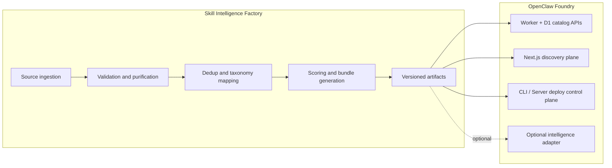
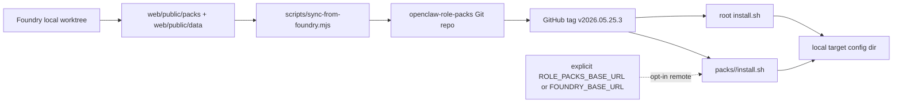
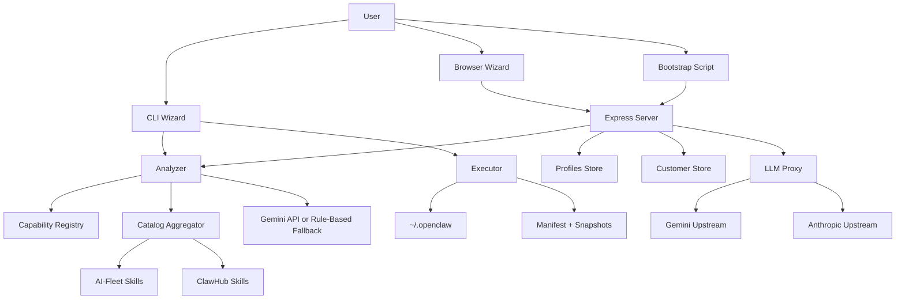
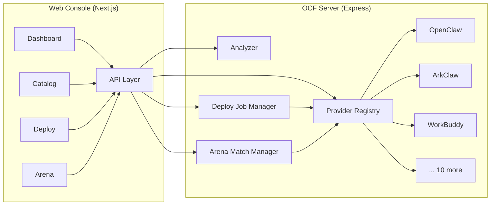

# SYSTEM_ARCHITECTURE - OpenClaw Foundry

## AI-Managed Project Block
- PROJECT_DIR: `/Users/mauricewen/Projects/22-openclaw-foundry`
- Canonical Initiative Path: `doc/00_project/initiative_openclaw_foundry/`
- Updated: `2026-05-25`

## System Boundary
OpenClaw Foundry 当前是统一的技能发现与部署控制产品面，支持 **13 platforms** across desktop / saas / cloud / mobile / remote modes. 当前 canonical 边界只覆盖已经存在的发现、部署、管理与比武能力；未来 Portal/资讯/商业化探索不属于本次已批准架构。

Runtime styles:
1. local execution through the `ocf` CLI
2. remote execution through an Express server plus static browser/bootstrap clients
3. multi-platform deployment via Provider dispatch
4. public web discovery with registered-session gates only for Job Pack payload delivery
5. standalone role-pack distribution through a local-first Git repo snapshot

The shared contract is `Blueprint v2.0`, a typed JSON document now including a `target` field for platform routing.

## 2026-04-23 Architecture Decision - Foundry x SOTA Skill Library

### Decision Summary
OpenClaw Foundry remains the single product surface, deployment control plane, and public catalog entrypoint.
`sota-skill-library` is not merged as a second runtime or second public site. Its durable value is re-scoped into a **Skill Intelligence Factory** that produces versioned artifacts, scoring heuristics, taxonomy maps, and bundle candidates for Foundry to consume.

### Not Chosen
1. No wholesale repository merge with Python runtime, local telemetry DBs, and local MCP installer paths moved directly into Foundry.
2. No second public dashboard or parallel marketplace UI.
3. No JIT/MCP runtime in the critical path of public catalog, deploy, or arena flows.

### Bounded Contexts
| Context | Responsibility | Current Anchors | Target Role |
| --- | --- | --- | --- |
| Skill Intelligence Factory | ingest, validate, dedup, categorize, score, bundle generation | `scripts/*.mjs` in Foundry plus selected SOTA heuristics | offline artifact producer |
| Discovery Plane | public browse/search/filter/detail UX and catalog APIs | `web/`, `worker/` | sole public skill marketplace |
| Deploy Control Plane | blueprint generation, provider dispatch, lifecycle commands | `src/cli.ts`, `src/server.ts`, `src/providers/*` | sole deployment runtime |
| Job Pack Auth / Payload Gate | email + WeChat registration/login, protected pack token minting, protected file delivery | `web/lib/session.ts`, `web/lib/protected-downloads.ts`, `worker/src/routes/auth*.ts`, `worker/src/routes/packs.ts` | preserve public browsing and Skill copy while gating Job Pack install/download payloads |
| Standalone Role Pack Repository | version current local role/job pack artifacts for copy-safe install | `/Users/mauricewen/Projects/openclaw-role-packs`, `https://github.com/MARUCIE/openclaw-role-packs` | pinned GitHub release plus local-first distribution snapshot |
| Optional Intelligence Adapter | related skills, route planning, future JIT assembly | future internal service built from SOTA ideas | optional sidecar, non-critical |

### Source-of-Truth Matrix
| Domain | Current State | Target State |
| --- | --- | --- |
| Skill catalog | split across `web/public/data/skills.json`, `data/unified-index.json`, D1 seeds, and external SOTA-local state | one canonical versioned artifact imported into D1 and exported to web cache |
| Bundle / pack candidates | `web/public/data/packs.json`, `collections.json`, SOTA `bundles.json` | one normalized bundle artifact with Foundry-owned schema |
| Role/job pack distribution | Foundry `web/public/packs/` plus standalone `openclaw-role-packs` snapshot | Foundry remains source worktree; production install command clones pinned tag `v2026.05.25.3` from GitHub, while standalone repo installers read local copied files by default |
| Deploy state | `~/.openclaw/*`, manifest, snapshots | unchanged |
| Customer / operator state | JSON + Worker/D1 split | explicit control-plane-owned persistence path |
| Recommendation / route planning | ad hoc / external prototypes | internal API or sidecar after artifact contract stabilizes |

### Target Topology

```mermaid
flowchart LR
  subgraph SIF[Skill Intelligence Factory]
    A[Source ingestion]
    B[Validation and purification]
    C[Dedup and taxonomy mapping]
    D[Scoring and bundle generation]
    E[Versioned artifacts]
    A --> B --> C --> D --> E
  end

  subgraph F[OpenClaw Foundry]
    F1[Worker + D1 catalog APIs]
    F2[Next.js discovery plane]
    F3[CLI / Server deploy control plane]
    F4[Optional intelligence adapter]
  end

  E --> F1
  E --> F2
  E --> F3
  E -. optional .-> F4
```

### Migration Phases
1. **Contract freeze**
   - define canonical skill schema, taxonomy semantics, rating semantics, dedup semantics, and bundle schema
2. **Shadow run**
   - compare current Foundry artifacts vs SOTA-derived artifacts on total count, ID churn, category spread, and score distribution
3. **Artifact cutover**
   - switch Foundry seed/build pipeline to the canonical artifact without changing public UX flows
4. **Intelligence opt-in**
   - rebuild recommendation / route-planning capabilities against Foundry-owned schema only after artifact stability is proven

### Rollback Rule
Rollback is artifact-level, not repo-level: the system must be able to restore the previous catalog/bundle artifact version without rewriting deploy state or provider code.

## High-Level Modules
| Module | Files | Responsibility |
| --- | --- | --- |
| CLI shell | `src/cli.ts`, `src/wizard.ts` | Collect local input, platform selection, call AI/catalog flows, execute lifecycle commands |
| Analysis engine | `src/analyzer.ts`, `src/capability-registry.ts` | Convert wizard answers and catalog data into `Blueprint`, then normalize and repartition |
| Catalog layer | `src/catalog.ts` | Scan local AI-Fleet skills and remote ClawHub skills |
| **Provider system** | `src/providers/*.ts` (12 files) | **v2.0: Multi-platform deployment abstraction (deploy/test/repair/uninstall/diagnose)** |
| Execution layer | `src/executor.ts` | Legacy install/export/repair/upgrade/rollback (wrapped by OpenClawProvider) |
| Server/API | `src/server.ts` | Expose health, analyze, catalog, providers, profile, customer, and LLM proxy |
| Persistence | `src/profiles.ts`, `src/customers.ts` | Store reusable profiles and managed customer tokens/usage |
| LLM gateway | `src/llm-proxy.ts` | Customer-authenticated OpenAI-compatible chat proxy |
| Static client | `client/` | Browser wizard with platform selection, bootstrap scripts |
| **Web Console** | `web/` (Next.js 15) | **v3.0: Visual management — Platform Catalog, One-Click Deploy, Arena** |
| Web session helper | `web/lib/session.ts`, `web/lib/protected-downloads.ts` | Browser-side registered-session checks plus Worker-backed protected copy/download helpers |
| Worker auth + pack payload API | `worker/src/routes/auth.ts`, `worker/src/routes/auth-wechat.ts`, `worker/src/routes/packs.ts`, `worker/src/migration-v10.sql` | Email/WeChat auth, short-lived pack download tokens, protected pack files backed by D1/R2 |
| Standalone role-pack repo | `/Users/mauricewen/Projects/openclaw-role-packs` | Copy-safe pack snapshot with root and per-pack local-first installers |
| **Deploy Manager** | `src/deploy-manager.ts` | **v3.0: Async deploy job lifecycle (create/poll/cancel)** |
| **Arena Engine** | `src/arena-engine.ts` | **v3.0: Multi-provider parallel execution + scoring** |

## Job Pack Auth and Protected Payload Architecture (2026-05-18)

The web product uses component/action-level auth gates, not a whole-site route wall. This keeps public discovery and ordinary Skill/MCP/API copy available while requiring a registered user for Job Pack payloads.

```mermaid
flowchart LR
  A[Anonymous visitor] --> B[Public web pages]
  B --> C{Copy / download / install?}
  C -- no --> B
  C -- Job Pack payload --> D[requireRegistered in web/lib/session.ts]
  D -->|no session| E[/login email magic-link or WeChat OAuth]
  E --> F[Registered session in localStorage]
  D -->|valid session + install copy| G[Clipboard GitHub tag command]
  D -->|valid session + single file| H[Worker protected pack routes]
  F --> G
  F --> H
  H --> I[D1 download token / R2 pack payload]
  I --> J[file download]
```

Static Pages output keeps public Job Pack `guide.html` files only. Protected single-file downloads are served through `GET /api/packs/:id/file?path=...` with a registered bearer session. The protected install-command copy now writes a pinned GitHub clone command for `https://github.com/MARUCIE/openclaw-role-packs.git` at `v2026.05.25.3` after the user is registered; it does not mint a Worker download token. The post-build prune script removes public static pack payload files from `web/out/packs` to close direct-link bypasses. Skill/MCP install command copy remains public. Static Pages catalog reads use `/data/*.json` directly when `NEXT_PUBLIC_API_URL` is unset, so production does not emit missing `/api/packs` console errors.

## Standalone Role Pack Distribution (2026-05-25)

The standalone repo `/Users/mauricewen/Projects/openclaw-role-packs` is a copy-safe release surface for current local role/job pack artifacts. It is published at `https://github.com/MARUCIE/openclaw-role-packs` and currently pinned by production install commands to tag `v2026.05.25.3`. It is intentionally separate from the Foundry product repo so a recipient can clone one release repo or copy one `packs/<id>/` directory and install without relying on the deployed website's pack cache.


```mermaid
flowchart LR
  A[Foundry local worktree] --> B[web/public/packs + web/public/data]
  B --> C[scripts/sync-from-foundry.mjs]
  C --> D[openclaw-role-packs Git repo]
  D --> E[GitHub tag v2026.05.25.3]
  E --> F[root install.sh]
  E --> G[packs/<id>/install.sh]
  F --> H[local target config dir]
  G --> H
  I[explicit ROLE_PACKS_BASE_URL or FOUNDRY_BASE_URL] -. opt-in remote .-> G
```

Installer invariant: production install command clones a pinned GitHub tag, then installer execution uses local sibling `manifest.json` and local artifact files as the default source. Remote fetching is an explicit override only.

## Product Manager / Designer Pack Boundary (2026-05-25)

The product line has two released frontdoor packs. `product-manager` owns PRD, user stories, RICE, prototype hypothesis, and clickable validation demo prompts. `designer` owns experience architecture, visual hierarchy, design tokens, design QA, advisor review, component states, responsive constraints, and engineering handoff. The retired `prototype-designer` slug is not kept as an alias so public catalog, guide, and Git install surfaces cannot imply that prototype ownership belongs to the Designer pack.

## Strategy Roundtable Job Pack Architecture (2026-05-25)

`strategy-roundtable-advisor` is the released frontdoor pack for the `/packs` `定策略` line. It packages the strategic-thinking workflow as a cross-agent installation surface rather than as a chat-only prompt.

```mermaid
flowchart LR
  A[/packs decision tree] --> B[定策略]
  B --> C[strategy-roundtable-advisor]
  C --> D[skills: cognitive-skeleton + multi-expert-roundtable-report + planning-with-files + cognitive-reflection]
  C --> E[skills: business-diagnosis-pipeline + product-management-swarm]
  C --> F[advisors: Munger + Drucker + Meadows]
  C --> G[toolkits + checklist + data collection templates]
  C --> H[openclaw-role-packs local-first installer]
```

Pack generation is owned by `scripts/sync-strategy-roundtable-pack.py`, which copies real AI-Fleet skills into `web/public/packs/strategy-roundtable-advisor/`, writes the manifest and install surface, and lets `web` prebuild regenerate `packs.json`, tiers, installers, and guides. The data decision entry is intentionally merged into one `data-ai` line (`做/看数据`) so the UI does not split algorithm/build data work from metrics/read data work at the first question layer.

## Provider Architecture (v2.0)
```
Blueprint.target.provider → ProviderRegistry.getProvider() → Provider.deploy()

BaseProvider (abstract)
├── CloudProvider (checkApiAccess, checkApiHealth, getEndpoint)
│   ├── JDCloudProvider (genericCloudDeploy)
│   │   ├── HuaweiCloudProvider
│   │   ├── AliyunProvider
│   │   └── DuClawProvider
│   ├── ArkClawProvider
│   └── WorkBuddyProvider
├── DesktopProvider (checkLocalInstall)
│   ├── OpenClawProvider (wraps legacy executor)
│   ├── LobsterAIProvider
│   └── AutoClawProvider
├── SaaSProvider (checkApiHealth)
│   ├── KimiClawProvider
│   └── MaxClawProvider
├── MobileProvider (checkDeviceConnection)
│   └── MiClawProvider
└── BaseProvider (direct)
    └── LenovoProvider (remote service)
```

### Supported Platforms (13)
| ID | Name | Vendor | Type | Status |
|----|------|--------|------|--------|
| openclaw | OpenClaw | Anthropic | desktop | stable |
| workbuddy | WorkBuddy/QClaw | Tencent | desktop | stable |
| lobsterai | LobsterAI | NetEase Youdao | desktop | beta |
| autoclaw | AutoClaw | Zhipu AI | desktop | stable |
| arkclaw | ArkClaw | ByteDance | saas | stable |
| duclaw | DuClaw | Baidu Cloud | saas | stable |
| kimiclaw | Kimi Claw | Moonshot AI | saas | stable |
| maxclaw | MaxClaw | MiniMax | saas | stable |
| jdcloud | JD Cloud OpenClaw | JD Cloud | cloud | beta |
| huaweicloud | Huawei Cloud | Huawei Cloud | cloud | beta |
| aliyun | AgentBay | Alibaba Cloud | cloud | stable |
| miclaw | miclaw | Xiaomi | mobile | preview |
| lenovo | Lenovo BaiYing | Lenovo | remote | preview |

## Runtime Topology

```mermaid
flowchart TD
  A[User] --> B[CLI Wizard]
  A --> C[Browser Wizard]
  A --> D[Bootstrap Script]
  B --> E[Analyzer]
  C --> F[Express Server]
  D --> F
  F --> E
  E --> G[Capability Registry]
  E --> H[Catalog Aggregator]
  H --> I[AI-Fleet Skills]
  H --> J[ClawHub Skills]
  E --> K[Gemini API or Rule-Based Fallback]
  B --> L[Executor]
  F --> M[Profiles Store]
  F --> N[Customer Store]
  F --> O[LLM Proxy]
  O --> P[Gemini Upstream]
  O --> Q[Anthropic Upstream]
  L --> R[~/.openclaw]
  L --> S[Manifest + Snapshots]
```

## Core Data Objects
1. `WizardAnswers` / `WizardAnswersV2`
   - Structured user intent collected from CLI or browser
   - v2 adds: `targetProvider`, `targetDeployMode`, `targetRegion`, `targetImChannel`, cloud credentials
2. `Blueprint` (v2.0)
   - Canonical deployment contract
   - Includes meta, **target** (provider + deployMode + credentials), identity, skills, agents, config, cron, MCP servers, extensions, LLM
   - `target` defaults to `{provider:'openclaw', deployMode:'local'}` for backward compatibility
3. `Provider` (interface)
   - Multi-platform deployment abstraction
   - Methods: deploy, test, repair, uninstall, diagnose, getRequirements, isAvailable
4. `Manifest`
   - Records files and directories written by Foundry
5. `Snapshot`
   - Captures pre-change installation state for rollback
6. `Customer`
   - Managed LLM subscriber record with token, tier, and usage stats

## Contract Guardrails
1. AI-generated blueprints are normalized before return
2. System-owned fields are enforced from trusted inputs:
   - `meta.os`
   - `meta.created`
   - `identity.role`
   - `config.autonomy`
   - `llm`
3. Skill IDs are deduplicated and re-partitioned against the current catalog source map

## Entrypoints
### CLI
- `npm run ocf -- init`
- `npm run ocf -- cast <file>`
- `npm run ocf -- doctor`

### Server
- `npm run server`
- `npm run dev`

### HTTP
- `GET /api/health` — includes provider stats
- `POST /api/analyze`
- `GET /api/catalog`
- **`GET /api/providers`** — list all 13 platforms (filter: ?type=, ?os=)
- **`GET /api/providers/:id`** — platform detail + requirements + availability
- **`GET /api/providers/:id/diagnose`** — platform health check
- `GET /api/profiles`
- `GET /api/profiles/:id`
- `POST /api/customers`
- `GET /api/customers`
- `GET /api/customers/:id`
- `PATCH /api/customers/:id/tier`
- `DELETE /api/customers/:id`
- `GET /llm/v1/models`
- `POST /llm/v1/chat/completions`
- `GET /foundry.sh`
- `GET /foundry.ps1`
- static files from `client/`

## Deployment / Storage Model
1. Repo-local:
   - `profiles/*.json`
   - `data/customers.json`
2. User machine:
   - `~/.openclaw/openclaw.json`
   - `~/.openclaw/IDENTITY.md`
   - `~/.openclaw/SOUL.md`
   - `~/.openclaw/skills/`
   - `~/.openclaw/agents/`
   - `~/.openclaw/.foundry-manifest.json`
   - `~/.openclaw/.snapshots/`

---

## Web Console Architecture (v3.0)

### Overview
Web Console 是 OpenClaw Foundry 的可视化管理界面，提供三大核心能力：

| Module | Purpose | Core Interaction |
|--------|---------|-----------------|
| **Platform Catalog** | 浏览全部 13 个 **Claw 平台，按类型/状态/OS 筛选 | 卡片网格 + 详情面板 |
| **One-Click Deploy** | 选择平台 → 配置 Blueprint → 一键部署 | 步骤向导 (Stepper) |
| **Arena 比武场** | 同一任务 dispatch 到多个 Claw，并行执行并横向对比 | 多列对比面板 + 实时状态 |

### Frontend Architecture

```
web/                          # Next.js 15 App Router
├── app/
│   ├── layout.tsx            # Root layout (sidebar + header)
│   ├── page.tsx              # Dashboard (overview stats)
│   ├── catalog/
│   │   ├── page.tsx          # Platform catalog grid
│   │   └── [id]/page.tsx     # Platform detail + requirements
│   ├── deploy/
│   │   ├── page.tsx          # Deploy wizard (stepper)
│   │   └── [jobId]/page.tsx  # Deploy job status
│   └── arena/
│       ├── page.tsx          # Arena setup (select task + claws)
│       └── [matchId]/page.tsx # Arena live match view
├── components/
│   ├── ui/                   # shadcn/ui primitives
│   ├── platform-card.tsx     # Provider card with status badge
│   ├── deploy-stepper.tsx    # Multi-step deploy flow
│   ├── arena-lane.tsx        # Single claw lane in arena
│   ├── blueprint-editor.tsx  # Blueprint JSON editor
│   └── status-badge.tsx      # Provider status indicator
├── lib/
│   ├── api.ts                # OCF server API client
│   ├── types.ts              # Shared types (re-export from src/)
│   └── hooks/
│       ├── use-providers.ts  # SWR hook for provider list
│       ├── use-deploy.ts     # Deploy job polling
│       └── use-arena.ts      # Arena match state
└── tailwind.config.ts
```

Tech stack: **Next.js 15** + **Tailwind v4** + **shadcn/ui** + **SWR** for data fetching.
Connects to existing Express server at `localhost:18800`.

### New Server API Endpoints (v3.0)

| Method | Path | Purpose | Module |
|--------|------|---------|--------|
| POST | `/api/deploy` | Start a deploy job (async) | Deploy |
| GET | `/api/deploy/:jobId` | Poll deploy job status | Deploy |
| POST | `/api/deploy/:jobId/cancel` | Cancel running deploy | Deploy |
| POST | `/api/arena` | Create arena match (N providers, 1 blueprint) | Arena |
| GET | `/api/arena/:matchId` | Poll arena match status | Arena |
| GET | `/api/arena/:matchId/results` | Final comparison results | Arena |
| GET | `/api/stats` | Aggregate dashboard stats | Dashboard |

### Deploy Job Model

```typescript
interface DeployJob {
  id: string;                    // "deploy-{timestamp}"
  status: 'pending' | 'running' | 'success' | 'failed' | 'cancelled';
  provider: ProviderId;
  blueprint: Blueprint;
  createdAt: string;
  startedAt?: string;
  completedAt?: string;
  result?: DeployResult;
  logs: StepResult[];            // Streaming step log
}
```

Deploy flow: POST /api/deploy → 202 Accepted (jobId) → GET poll → final result.
Server stores jobs in-memory Map with TTL (1 hour).

### Arena Match Model

```typescript
interface ArenaMatch {
  id: string;                    // "arena-{timestamp}"
  status: 'setup' | 'running' | 'completed' | 'failed';
  task: {
    blueprint: Blueprint;        // Shared blueprint template
    testPrompt: string;          // The task all claws will execute
  };
  lanes: ArenaLane[];            // One per selected provider
  createdAt: string;
  completedAt?: string;
  winner?: ProviderId;           // Auto-determined or user-voted
  scoring?: ArenaScoring;
}

interface ArenaLane {
  provider: ProviderId;
  status: 'pending' | 'deploying' | 'testing' | 'done' | 'error';
  deployResult?: DeployResult;
  testResult?: TestResult;
  timing: {
    deployMs?: number;
    testMs?: number;
    totalMs?: number;
  };
  score?: number;                // 0-100 composite score
}

interface ArenaScoring {
  dimensions: {
    deploySpeed: Record<ProviderId, number>;    // Lower ms = higher score
    testPassRate: Record<ProviderId, number>;   // % checks passed
    featureSupport: Record<ProviderId, number>; // Requirements met
    platformReach: Record<ProviderId, number>;  // OS + IM coverage
  };
  overall: Record<ProviderId, number>;
  method: 'weighted-average';
  weights: { deploySpeed: 0.2; testPassRate: 0.4; featureSupport: 0.25; platformReach: 0.15 };
}
```

Arena flow:
1. User selects 2-5 providers + writes a task prompt
2. POST /api/arena → creates match, spawns parallel deploy+test per lane
3. Frontend polls GET /api/arena/:matchId → updates lane status in real-time
4. When all lanes complete → server computes scoring → determines winner
5. Frontend shows side-by-side comparison with scores + timing + logs

### Page Architecture

#### P1: Dashboard (`/`)
- Provider count by type (4 cards: Desktop / SaaS / Cloud / Mobile+Remote)
- Recent deploy jobs (last 5)
- Recent arena matches (last 3)
- System health (server uptime, API latency)

#### P2: Platform Catalog (`/catalog`)
- Filter bar: type | status | OS | IM channel
- Card grid: each card shows logo placeholder, name, vendor, type badge, status badge
- Click → detail page with:
  - Full provider meta
  - Requirements checklist (with live availability check)
  - Quick actions: Deploy / Add to Arena / Diagnose
  - Console URL + Doc URL external links

#### P3: Deploy Flow (`/deploy`)
- Step 1: Select provider (from catalog or dropdown)
- Step 2: Configure blueprint (profile preset or manual JSON editor)
- Step 3: Review blueprint summary
- Step 4: Deploy + real-time log streaming
- Step 5: Result summary + next actions (test / diagnose / open console)

#### P4: Arena (`/arena`)
- Setup panel: select 2-5 providers + enter task prompt
- Live view: N columns (one per provider), each showing:
  - Status indicator (spinner → checkmark/cross)
  - Deploy steps log
  - Test results
  - Timing
- Results panel: radar chart + score table + winner badge

### Data Flow


```mermaid
flowchart LR
  subgraph "Web Console (Next.js)"
    D[Dashboard] --> API
    C[Catalog] --> API
    DP[Deploy] --> API
    AR[Arena] --> API
  end
  subgraph "OCF Server (Express)"
    API[API Layer]
    API --> PR[Provider Registry]
    API --> AN[Analyzer]
    API --> DJ[Deploy Job Manager]
    API --> AM[Arena Match Manager]
    DJ --> PR
    AM --> PR
    PR --> P1[OpenClaw]
    PR --> P2[ArkClaw]
    PR --> P3[WorkBuddy]
    PR --> PN[... 10 more]
  end
```

### Security Constraints
- Web Console runs same-origin or CORS with existing `x-api-key` guard
- Cloud credentials (accessKeyId/Secret) are server-side only, never sent to frontend
- Arena matches are rate-limited (max 3 concurrent, 10/hour)
- Deploy jobs respect existing `checkApiReady()` guard per provider

## Architecture Risks
1. Provider routing gap:
   - `routeModel()` can return `openai`, but `createLlmProxy()` does not implement an OpenAI upstream caller
2. Persistence simplicity:
   - customers are stored in a JSON file, which is acceptable for MVP but weak for concurrent writes
   - Deploy jobs and arena matches use in-memory Map (acceptable for single-instance, lost on restart)
3. Git boundary mismatch:
   - repository directory lives inside a parent git root, which weakens project-isolated git health checks
4. Export parity gap:
   - exported installers do not preserve full equivalence with local execution for AI-Fleet symlinked skills
5. Auth boundary split:
   - `/api/*` uses optional shared API key, while `/llm/v1/*` uses bearer customer tokens
6. Documentation split:
   - `docs/` historical material can drift unless future changes only update `doc/`
7. Arena concurrency:
    - Parallel provider.deploy() calls share the same process; a slow/hanging provider blocks the event loop
    - Mitigation: per-lane timeout (60s) + AbortController
8. Web Console coupling:
   - Next.js dev server + Express server run on different ports; production needs reverse proxy or embedding
   - Mitigation: Next.js `rewrites` proxy `/api/*` to OCF server in dev; production co-locate or Caddy proxy
9. Catalog truth drift:
    - skill data currently has multiple effective truth sources (`web/public/data/skills.json`, `data/unified-index.json`, D1 seed inputs, and external SOTA-local state)
    - Mitigation: freeze one canonical artifact contract and demote all other paths to cache, staging, or legacy input only
10. Runtime coupling risk:
    - directly importing SOTA runtime concerns (local telemetry DB, MCP router, local installer) into Foundry would couple portal, deploy runtime, and local agent execution too tightly
    - Mitigation: import heuristics and artifacts first; keep JIT/MCP as optional adapter or sidecar
11. Standalone pack repo drift:
    - `openclaw-role-packs` is a release snapshot, so it can diverge from Foundry local edits if not refreshed before sharing or before moving the production Git ref
    - Mitigation: run `npm run sync:from-foundry`, `npm run validate`, and `npm run smoke:install` before the next role-pack release commit/tag

---

## v4.0 升维: Console → Portal (一键部署 + 导航 + 资讯 + 商业化)

### 升维动机

v3.0 是内部管理 Console (4 页: Dashboard/Catalog/Deploy/Arena)。
v4.0 定位为**中国 OpenClaw 生态一站式公开入口**:
- 流量入口: SEO + 社区传播 → 用户发现 OpenClaw 平台
- 部署入口: 12 平台一键部署 (3 Tier 自动化)
- 导航入口: ClawHub Skill 市场 + MCP 服务器目录
- 资讯入口: 大厂动态 + 版本追踪 + 教程
- 商业入口: 云厂商返佣 + 企业部署服务

### v4.0 Provider 架构 (v3.0 审计后重建)

v2.0/v3.0 审计发现: 13 Provider 中仅 OpenClaw 1 个真实 (7.7%)，其余 12 个 API 全是编造的。
v4.0 基于 9 个研究 Agent 的调查结果重建:

```
Tier 1 全自动 (7)              Tier 2 半自动 (3)            Tier 3 引导式 (2)
├── openclaw (curl+files)      ├── qclaw (QQ Bot)           ├── kimiclaw (Web SaaS)
├── hiclaw (curl+Higress)      ├── arkclaw (飞书 QR)        └── duclaw (Web SaaS)
├── copaw (pip+CLI)            └── maxclaw (注册+API)
├── autoclaw (CLI --no-interactive)
├── huaweicloud (Python SDK)
├── jdcloud (Python SDK)
└── aliyun (Python SDK)
```

砍掉: miclaw(封测) / 联想(IT服务) / WorkBuddy(合并QClaw) / LobsterAI(需源码构建)
新增: hiclaw(阿里开源团队版) / copaw(阿里开源个人版) / qclaw(腾讯QQ Bot)

### v4.0 页面架构 (Information Architecture)

```
/                              首页 Landing
│                              Hero + 12 平台卡片 + 快速部署 CTA + 最新资讯
│
├── /deploy                    一键部署
│   ├── /deploy/[provider]     平台专属页 (12个, 各含部署向导)
│   └── /deploy/history        部署历史
│
├── /packs                     岗位配置包 (主 CTA; copy/download 需要注册)
├── /skill                     Skill 市场 (安装命令复制公开)
├── /login                     注册/登陆 (邮箱 magic link + 企业微信 OAuth; 配置驱动)
├── /explore                   导航发现
│   ├── /explore/platforms     已废弃: Pages `_redirects` 301 到 /packs
│   ├── /explore/skills        ClawHub Skill 市场 (搜索/分类/一键安装)
│   └── /explore/mcp           MCP 服务器目录
│
├── /news                      资讯中心
│   ├── /news/feed             信息流 (RSS 聚合)
│   ├── /news/releases         版本追踪 (各平台 changelog)
│   └── /news/tutorials        教程合集
│
├── /arena                     竞技场 (保留, 增强)
├── /pricing                   定价对比 + 返佣入口
└── /about                     关于 + 企业合作
```

### vs v3.0 变更矩阵

| v3.0 Page | v4.0 Page | 变化 |
|-----------|-----------|------|
| `/` Dashboard (内部统计) | `/` Hero Landing (公开) | 管理后台 → 公开入口 |
| `/catalog` (平台列表) | `/packs` + `/skill` (岗位包 + Skill 市场) | 平台总览页废弃；主 CTA 回到岗位配置包 |
| `/deploy` (4步向导) | `/deploy/[provider]` (专属页) | 每平台独立 |
| `/arena` (竞技场) | `/arena` (保留增强) | +评分维度 |
| — | `/explore/skills` | 新增 ClawHub |
| — | `/explore/mcp` | 新增 MCP 目录 |
| — | `/news` | 新增资讯聚合 |
| — | `/pricing` | 新增商业化 |

### Auth Capability Surface (2026-05-18)

```text
Pages /login
  └─ GET Worker /api/auth/config
       ├─ email.enabled = true only when Resend is configured
       └─ wechat.enabled = true only when Enterprise WeChat secrets are configured

Pages /login email submit
  └─ POST Worker /api/auth/request
       ├─ production without RESEND_API_KEY -> 503, no fake sent state
       └─ delivered_via=resend -> UI may show "已发送，请查收邮箱"
```

Production rule: `console_fallback` is allowed only outside `ENVIRONMENT=production`. The Worker must not create an apparent successful login email flow when the email provider is unconfigured.

### 新增数据模型

```typescript
// ClawHub Skill 条目
interface SkillEntry {
  id: string;
  name: string;
  description: string;
  source: 'clawhub' | 'tencent-fork' | 'aifleet' | 'community';
  category: string;
  installCmd: string;
  stars?: number;
  downloads?: number;
  compatibleProviders: ProviderId[];
  tags: string[];
}

// MCP 服务器条目
interface McpServerEntry {
  id: string;
  name: string;
  description: string;
  type: 'stdio' | 'http' | 'sse';
  installCmd: string;
  npmPackage?: string;
  github?: string;
  category: string;
}

// 资讯条目
interface NewsItem {
  id: string;
  title: string;
  summary: string;
  url: string;
  source: string;
  category: 'release' | 'tutorial' | 'news' | 'analysis';
  publishedAt: string;
  tags: string[];
  provider?: ProviderId;
}

// 平台定价
interface PricingTier {
  providerId: ProviderId;
  tiers: {
    name: string;
    price: string;
    features: string[];
    affiliateUrl?: string;
  }[];
}
```

### 商业化模型

| 收入来源 | 模式 | 入口 |
|----------|------|------|
| 云厂商 CPS 返佣 | 华为/京东/阿里注册链接 | /pricing + /deploy |
| 企业部署服务 | 定制部署+培训 | /about 表单 |
| Skill 市场分成 | 付费 Skill 上架 | /explore/skills |
| 流量广告 | 导航站 Banner | 全站 |
| 数据报告 | 行业分析 | 付费订阅 |

### 技术栈 (增量)

| 新增 | 技术 | 用途 |
|------|------|------|
| ISR | Next.js Incremental Static Regeneration | 资讯页 6h 刷新 |
| RSS Parser | `rss-parser` npm | 聚合 IT之家/36kr |
| GitHub API | Octokit | 版本追踪 |
| SQLite/Turso | 持久化 | 部署历史+资讯缓存 |
| Plausible | 分析 | 隐私友好 |
| Vercel/CF Pages | 部署 | 静态+SSR |

### Stitch 设计管线

架构确认后，走 3 轮 Stitch 设计:

| Round | 页面 | 产出 |
|-------|------|------|
| R1 | 首页 Hero + 快速部署 | 3 方案 → 选 Winner |
| R2 | Skill 市场 + MCP 目录 | 3 方案 → 选 Winner |
| R3 | 资讯中心 + 定价页 | 3 方案 → 选 Winner |

### 实施路线

| Phase | 内容 | 依赖 |
|-------|------|------|
| P0 | Provider v3.0 真实实现 (进行中) | — |
| P1 | Stitch R1: 首页 + 部署页 | P0 |
| P2 | Stitch R2: Skill + MCP 导航 | P1 |
| P3 | 资讯聚合引擎 + /news | P1 |
| P4 | 商业化: /pricing + 返佣 | P2 |
| P5 | Stitch R3: 资讯 + 定价 | P3+P4 |
