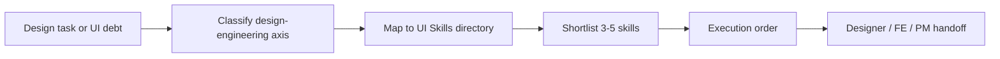

# Skill · ui-skills-directory

> Source: Designer pack
> When to use: 需要从 UI Skills 目录中为当前产品界面、设计系统、可访问性、动效或前端交付问题选择合适的设计工程 skill 组合。

## 是什么

这是一套把 UI Skills 目录接入设计基建包的技能路由方法。它不把外部目录当成无限制依赖，也不替 Designer 生成产品方向；它根据当前界面问题，把 `ui-skills.com` 的设计工程能力按 accessibility、motion、systems、visual、interaction、performance、craft、taste 等维度映射成可执行的 skill shortlist。

## 怎么用

1. 先确认当前任务阶段：intake、architecture、tokens、accessibility、motion、implementation QA、launch polish。
2. 把问题归类到 UI Skills 能力轴：accessibility / motion / systems / visual / interaction / performance / craft / taste。
3. 从目录中选择 3-5 个候选 skill，并说明每个 skill 的使用条件和不适用边界。
4. 将候选 skill 排成执行顺序：先基础质量，再视觉系统，再动效/性能，再最终 polish。
5. 输出 handoff 表，写清楚 Designer、Frontend Engineer、PM 各自需要处理的事项。

## 架构图

## Trigger phrases

- "整合 UI Skills"
- "从 ui-skills.com 选技能"
- "这个页面需要哪些设计工程 skill"
- "设计基建包要怎么补强"
- "给这个 UI 任务配一组 skill"

## Inputs

- 当前产品界面、截图、HTML、URL、PRD 或设计债描述
- 当前阶段：设计评审、系统化、可访问性修复、动效性能、前端实现 QA
- 已有约束：品牌、组件库、技术栈、上线时间、设计/前端分工
- 可选来源：`https://www.ui-skills.com/` 或其 GitHub repository

## Outputs

- UI Skills shortlist：skill / category / why now / use boundary
- Execution sequence：先做什么，后做什么，停止条件是什么
- Handoff table：Designer / Frontend Engineer / PM owner
- Risk notes：外部 skill 适配风险、重复能力、过度 polish 风险

## Procedure

1. **Read task evidence** -> 只基于当前界面问题和交付阶段选 skill。
2. **Classify axis** -> 把问题映射到 accessibility、motion、systems、visual、interaction、performance、craft、taste。
3. **Select shortlist** -> 选择 3-5 个互补 skill，避免同质堆叠。
4. **Sequence work** -> quality gates first, polish second, advanced motion last。
5. **Assign owners** -> Designer 负责审美、结构和 handoff；Frontend Engineer 负责实现和性能验证；PM 负责产品判断。
6. **Record source** -> 记录目录来源 URL、查看日期和入选理由，避免不可追溯的外部引用。

## Gotchas

- 不要把 UI Skills 目录当成产品需求来源。
- 不要一次性安装或推荐全部 skill；只选择当前任务需要的最小组合。
- 不要让 taste / polish skill 先于 accessibility、layout、state coverage。
- 不要把 Frontend Engineer 的实现验证转移给 Designer。
- 不要引用目录快照为永久事实；外部 skill 目录会变化，使用时要重新确认。

## Worked example

- Input: "SaaS dashboard feels generic, mobile risk unknown, needs launch polish."
- Output: shortlist `baseline-ui` for component/layout checks, `fixing-accessibility` for WCAG risks, `interface-design` for dashboard composition, `make-interfaces-feel-better` for micro-interactions, and `fixing-motion-performance` only after motion is added.

Agent Foundry Team
